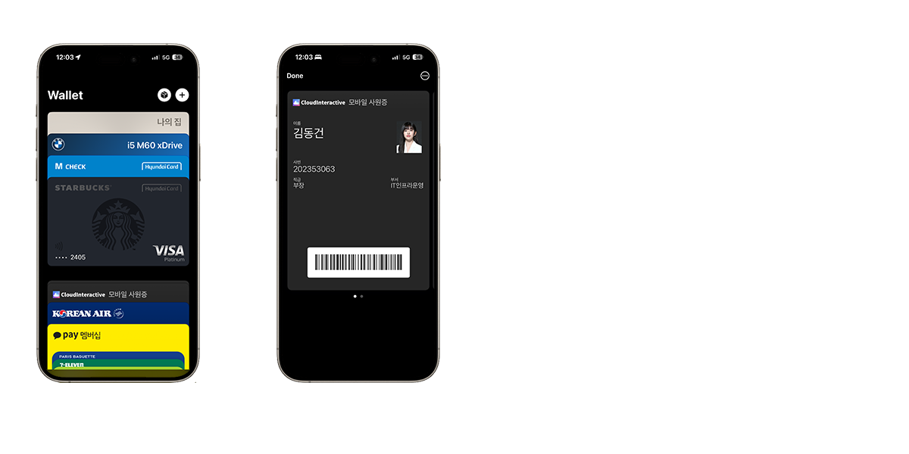
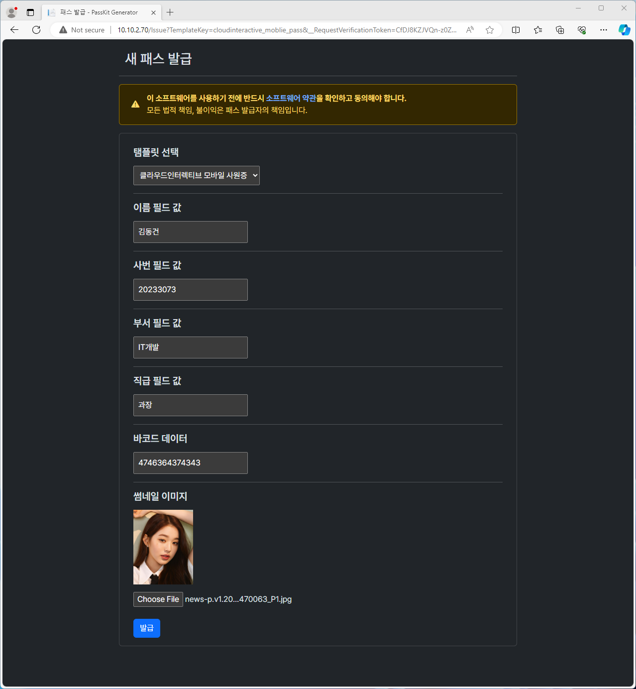
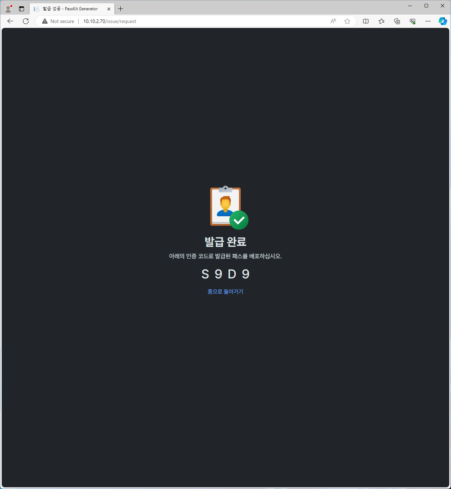
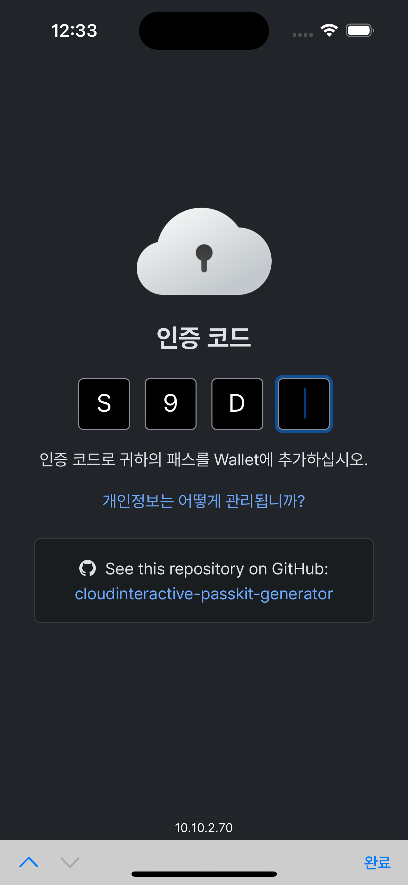
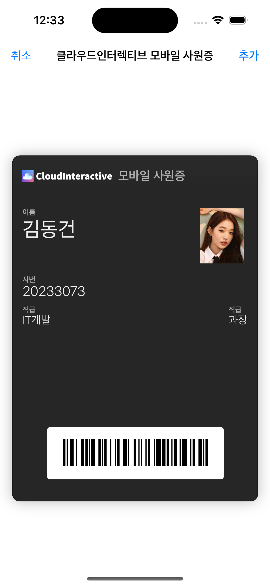
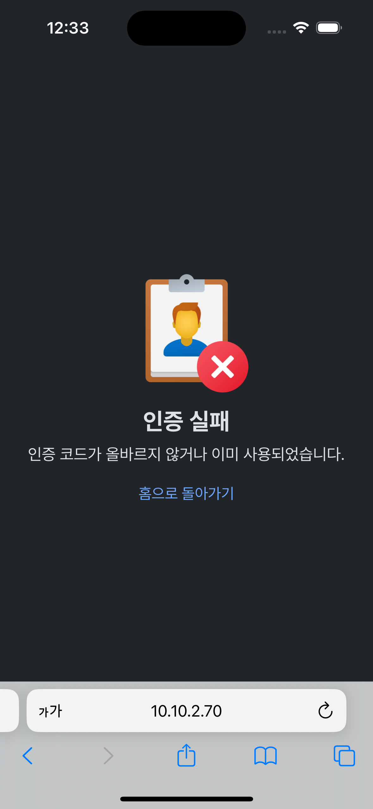
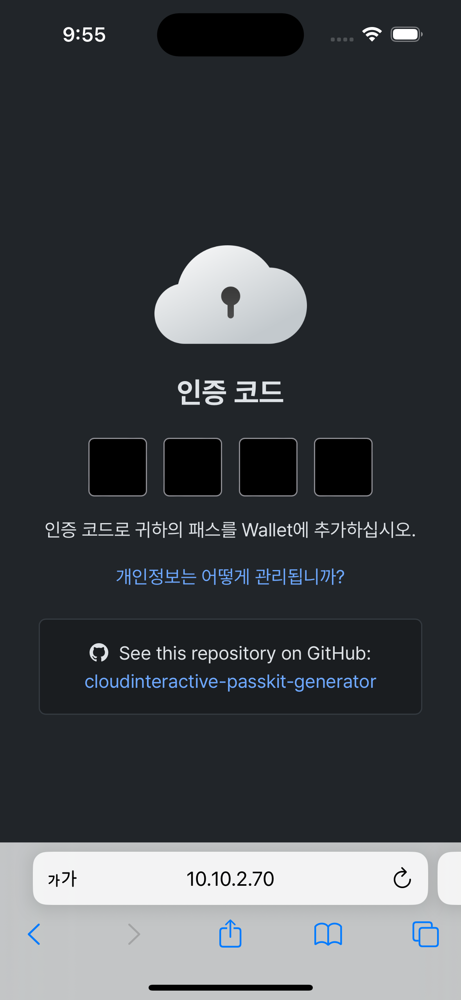
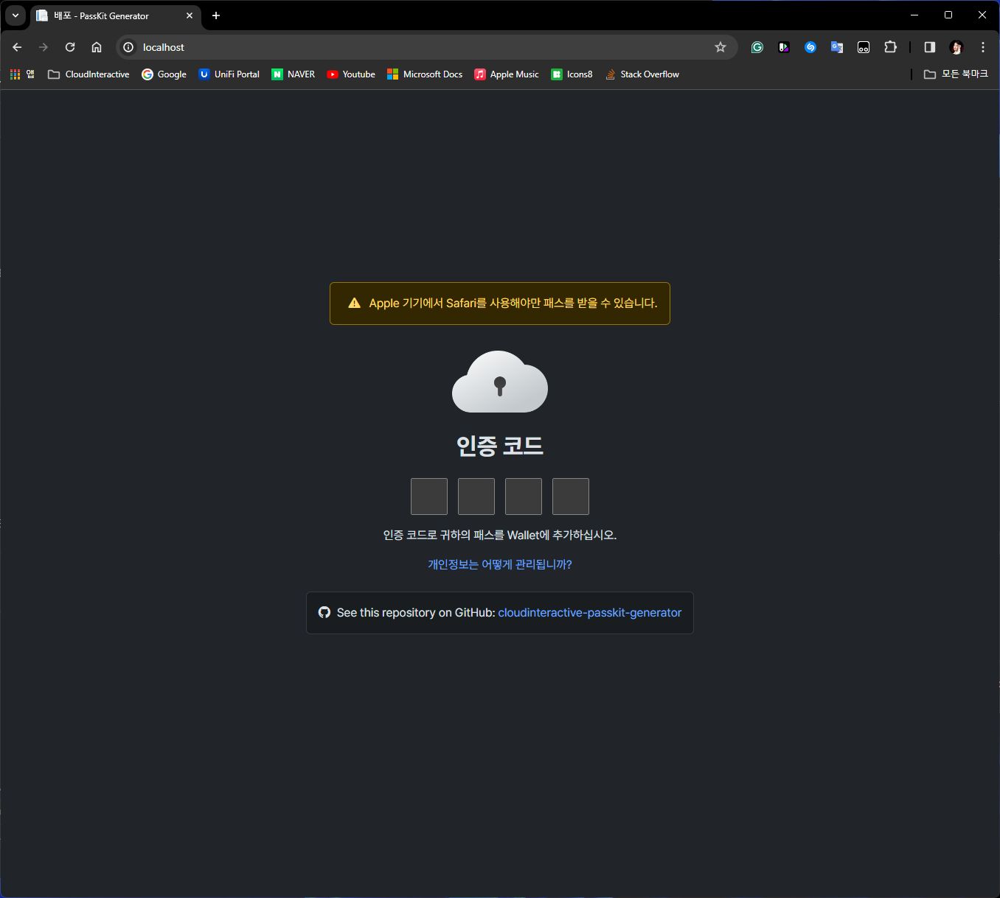
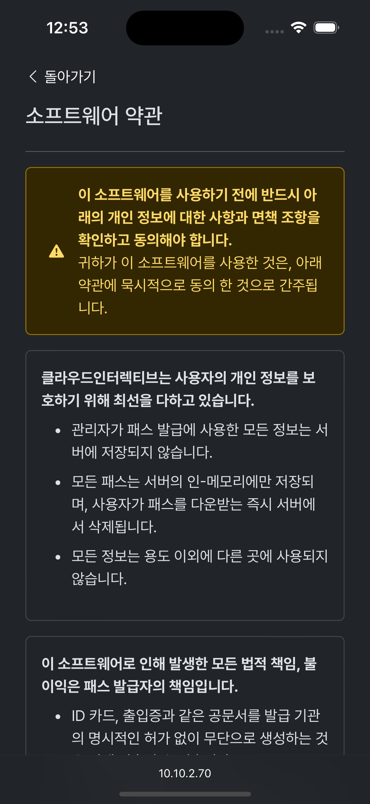

 # cloudinteractive-passkit-generator
 

>[!NOTE]
>**Currently, this project is only available in Korean (국문).**
>
>English may be supported in the future release. 

**귀사의 ID 카드, 출입증을 손쉽게 Apple PassKit 프레임워크를 사용하여 Apple Wallet에 추가하십시오.**

이 프로젝트는 Microsoft ASP.NET MVC 프레임워크를 통해 웹에서 사원증, 출입 카드등을 쉽게 Apple PassKit으로 생성하는 도구입니다.

패스의 탬플릿을 생성하고 이를 통해 다양한 패스를 생성할 수 있습니다.



>[!WARNING]
>**ID 카드, 출입증과 같은 공문서를 발급 기관의 명시적인 허가 없이 무단으로 생성하지 마십시오.**
>
> 이 소프트웨어를 사용하여 발급한 패스를 사용하여 발생한 법적 처벌, 불이익에 대하여 어떠한 책임도 지지 않습니다.

### Table of Content
- [Requirements](#requirements)
- [How to Use](#how-to-use)
- [Dependencies](#dependencies)
- [Showcase](#showcase)

## Requirements

- Linux Docker Engine
- Apple WWDR Intermediate Certificate G4
- Apple Pass Type ID Certificate

>[!NOTE]
>유효한 Apple Pass Type ID Certificate를 발급받기 위해서 Apple Developer Program이 필요합니다.

## How to Use
**사용하기 전에 인증서와 템플릿을 준비하여 Docker에 마운트 해야 합니다.**

### 인증서 준비하기
먼저, 아래 페이지에서 Apple WWDR Intermediate Certificate G4 중간 인증서를 받으십시오:
https://www.apple.com/certificateauthority/

그리고 아래 절차를 따라 dotnet-passbook에서 사용할 수 있게 Pass Type ID 인증서를 준비하십시오:
https://github.com/tomasmcguinness/dotnet-passbook/blob/master/using-openssl.md

총 3개의 인증서 파일이 준비되어야 합니다.
- **AppleWWDRCAG4.cer** - Apple WWDR Intermediate Certificate G4
- **passbook.pfx** - 준비한 Apple Pass Type ID 인증서
- **passbook_password.txt** - 위의 인증서의 암호를 평문으로 저장한 파일

모든 파일을 certs 디렉토리 안에 넣으십시오.
<hr>

### 템플릿 준비하기
새 디렉토리를 생성하고 디렉토리 안에 아래의 구성 요소가 모두 포함되어야 합니다.

디렉토리의 이름은 템플릿의 고유한 ID가 됩니다.

- **metadata.json** - 템플릿 메타데이터
- **img/icon.png** - 아이콘 이미지
- **img/logo.png** - 로고 이미지 (패스의 상단에 표시)

메타데이터는 레포지토리의 예시 템플릿 메타데이터를 참조하십시오.

메타데이터 일부 속성에 대한 자세한 설명은 [Apple Developer Document](https://developer.apple.com/documentation/walletpasses/pass) 문서를 참조하십시오.


모든 템플릿을 templates 디렉토리에 두십시오.

**모든 작업을 마쳤으면 루트 디렉토리가 아래와 같이 구성되어야 합니다.**
```
copperminesp@MainPC                                                                    
~\Desktop\test ❯ ls

    Directory: C:\Users\Coppermine\Desktop\test

Mode                 LastWriteTime         Length Name
----                 -------------         ------ ----
d----           3/25/2024  8:43 PM                certs
d----           3/24/2024 11:12 PM                templates
```
<hr>

### Docker에서 구동하기
Docker Hub에서 [cloudinteractive-passkit-generator](https://hub.docker.com/repository/docker/copperminesp/cloudinteractive-passkit-generator) 이미지를 가져오십시오.

위에서 만든 루트 디렉터리를 컨테이너의 /config에 마운트하고 이미지를 Run 하십시오.

**위의 모든 설명을 제대로 이해했다면, 컨테이너의 파일은 아래와 같이 구성되어야 합니다.**


<hr>

### 패스 발급하기
패스를 발급하려면 발급 페이지로 가십시오.
```
http://localhost/issue
```

템플릿을 선택하고 필요한 필드를 채우십시오.



발급이 완료되면 인증 코드가 부여됩니다.



>[!WARNING]
>**패스는 서버의 인-메모리에만 저장됩니다.**
>
> 서버 컨테이너가 재시작되거나 사용자가 인증 코드를 사용하면 서버에서 즉시 패스가 삭제됩니다.


<hr>

### 패스 추가하기
사용자가 패스를 추가하려면 인증 페이지로 가십시오.
```
http://localhost
```

인증 코드를 입력하고 페스를 추가하십시오.





사용자가 한번 인증 코드를 사용하면, 더 이상 해당 인증 코드를 사용할 수 없습니다.



```
2024-03-26 00:32:12 info: PassKitGenerator[0]
2024-03-26 00:32:12       Create new pass #S9D9 (template: cloudinteractive_moblie_pass).
2024-03-26 00:33:40 info: PassKitGenerator[0]
2024-03-26 00:33:40       Pass destroyed #S9D9.
```

## Showcase
**인증 페이지**






<hr>

**발급 페이지**


<hr>

**약관 페이지**




## Dependencies
- **dotnet-passbook** - https://www.nuget.org/packages/dotnet-passbook/3.2.4?_src=template
- **Newtonsoft.Json** - https://www.nuget.org/packages/Newtonsoft.Json/13.0.3?_src=template
- **Microsoft.VisualStudio.Azure.Containers.Tools.Targets** - https://www.nuget.org/packages/Microsoft.VisualStudio.Azure.Containers.Tools.Targets/1.17.2?_src=template
